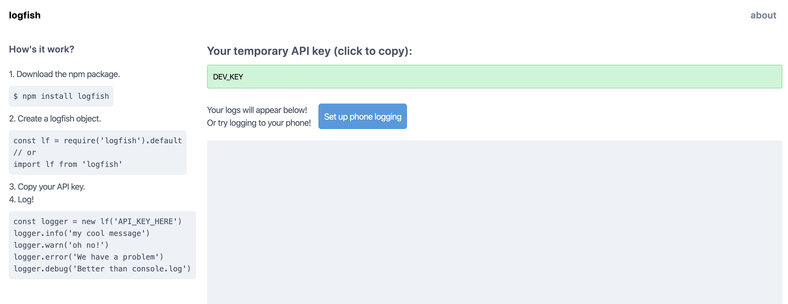

# Logfish React client

This is the code for the Logfish client. Before you set up this client, first follow the instructions for setting up the server locally at [https://github.com/bandrewfisher/logfish_server](https://github.com/bandrewfisher/logfish_server). After you have set up the server and this client locally, you can start using Logfish by downloading the Logfish npm package: [https://www.npmjs.com/package/logfish](https://www.npmjs.com/package/logfish)

## Clone this repository and install dependencies

SSH:
```
$ git clone git@github.com:bandrewfisher/logfish_client.git && cd logfish_client
$ yarn install
```

HTTPS:
```
$ git clone https://github.com/bandrewfisher/logfish_client.git && cd logfish_client
$ yarn install
```

## Run the project

The Logfish server by default runs on port 8081, and by default this client will attempt to connect to a Logfish server on that port. Once you have successfully started the server, all you need to do to start the client is:

```
$ yarn start
```

Assuming you didn't already have some other process running on port 3000, your client will be running on port 3000. In your browser just navigate to [http://localhost:3000](http://localhost:3000) to see the client! If your server was set up correctly, you should see an API key in the green box at the top. Otherwise, you probably made a mistake setting up your server.



Note that when running locally, the API key will always be DEV_KEY (unless you run your server in production mode. See the server setup instructions if you are interested in doing so). This is for convenience. If the server were remote, a UUID would be provided instead of DEV_KEY. However, currently the server is not running remotely because I don't want to pay any more on my AWS bill :)

Now you can log like usual with the logfish npm package, just copy the API key from your browser! Note that if your server is running locally, the API key will always be DEV_KEY for convenience.

